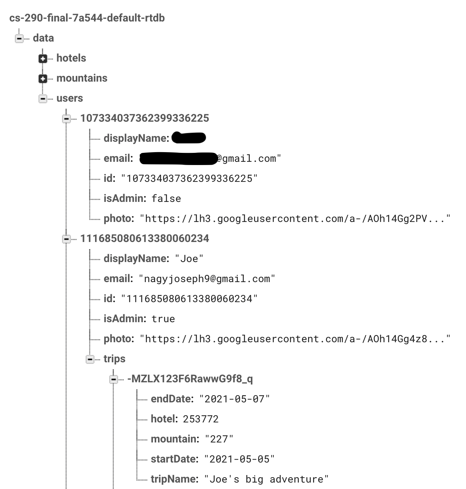
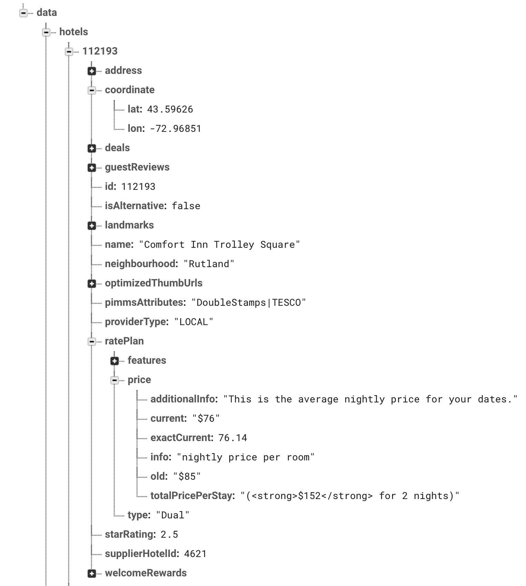
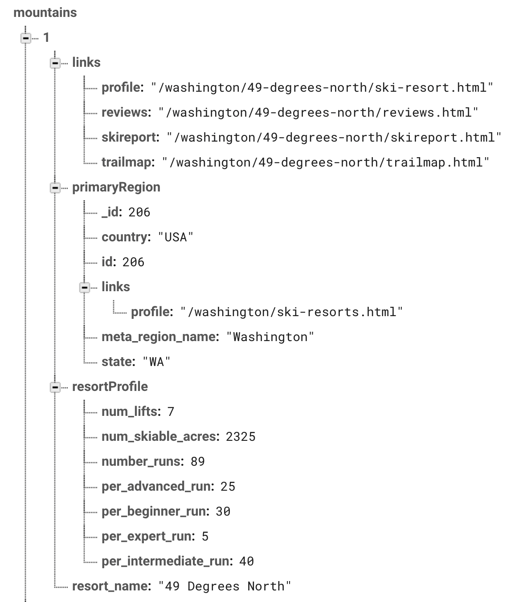

# Current Status
This application is currently under maintence. 

# Project Description 
My project is a web app that allows you to plan ski and snowboarding trips with friends. You can plan a trip with a date, mountain, hotel and flight information and send invites to your friends via gmail. 

# Data 
- For mountain related data I got all of the data I needed from OnTheSnow.com, specifically through [this](https://skiapp.onthesnow.com/app/widgets/resortlist?region=us&regionids=429&language=en&pagetype=profile&direction=1&order=resort&limit=1000&countrycode=USA&minvalue=-1&open=anystatus) API. This was not something they publically advertise, but I was able to find this by looking through their webpages using the Chrome network tab. 
- For mountain related data I used Hotels.com's public API found [here](https://rapidapi.com/tipsters/api/hotels-com-provider?endpoint=apiendpoint_75458408-e67a-4288-b917-2fa9887d081a)

# Database Structure 

### Users + Trips

### Hotels

### Mountains

# User Types

### Guest
Guests are able to view all of the data on the page, but they cannot create trips or add mountains + hotels to trips

### User
Users are able to both view all of the data on the page as well as create trips and add mountains + hotels to trips

### Admin
Admins have the same accessability as Users, except they're able to see every user's data at the bottom of the welcome tab. 

# Bad Input 
The app checks for bad input in multiple areas. It prevents guests from adding trips or saving any data in the database. The hotel tab prevents users from selecting dates that are either in the past or dates where the start date is after the end date. 

# Frameworks 
- Puppeteer: It was definitely a mistake to use Puppeteer for webscraping. I originally used it because it is in javascript and very compatable with Node.js. The issue was that it's essentially incompatable with Heroku, so I was not able to fully deploy aspects of my web app (specifically the ability to view trailmaps) which use webscraping. 
- Vue-Fuse component: I think this was a great addition to my project. I use this component to search for mountains on the mountains page. It was very easy to implement and works great. The only slight downside is sometimes it takes an extra second to load because there are so many mountains in the list. 

# User Feedback 

### Brenden Shenouski (4/28/2021)
The mountain search worked spectacularly and i liked the difficulty distribution, however, the trail maps didn’t work (only one showed up that was the arapahoe ski basin) and then the add to trips didn’t work because it wouldn’t allow me to create a trip under the trips tab. The hotel tab could work but idk lat longitude so i can’t really find a place. Flights didn’t work it broke the page giving us an error saying I wasn’t in a database and I had to close the page and reopen it. Like I said the concept is really cool and if it were fully operational I would definitely use it 

### Faith Ann (4/28/2021)
The welcome page did a decent job of explaing what the app did. I was confused how the login worked I pressed the login button and it redirected me to google and I was a bit confused by that, so I think you should explain that the app uses google as a login. The mountain tab worked great except it was a little slow if you type quickly into the search bar. The trail map button didn’t work and I wish it did because that would be a pretty useful feature. The hotels tab worked but I had to look up locations latitude and longitude because I have no idea what those are. You should change that to be more user friendly. The flights tab didn’t work at all. The trips tab didn’t work at all it kept telling me I had to sign in but again was confused by how signing in worked. Overall, pretty cool Idea but needs a lot of work before I would ever actually use it. 

### Jared Fenley (4/28/2021)
Overall your idea is pretty sick and something I’d use. I think the user interface needs work because it doesn’t look that good. The login worked and signed me in using google which is pretty cool. I was able to search and look at mountain but the trail map button didn’t work. I kept trying to add a mountain to a trip but it said I had to make a trip first. You should let users do that from there so they don’t have to switch tabs. The hotels tab worked but only after I looked up a latitude and longitude. You gotta fix that because no one will ever use this if they have to look that up. You should also give more details on the hotels like amenities and stuff like that. The flight tab didn’t work and broke the website when I tried to click the button. The trips tab worked once I signed in and I was able to add a hotel and mountain to it. I couldn’t add another mountain or overwrite a mountain on the trip which was kinda annoying. I also couldn’t delete them which is something you should also do. Overall, it’s a pretty cool concept I think you just need to work on it some more. 

# Bugs 
- Sometimes you need to reload the Trips page to reload your trips. 

# Resources
- Get min/max from array of objects: https://stackoverflow.com/questions/8864430/compare-javascript-array-of-objects-to-get-min-max
- Convert object of objects into array of objects: https://stackoverflow.com/questions/26795643/how-to-convert-object-containing-objects-into-array-of-objects
